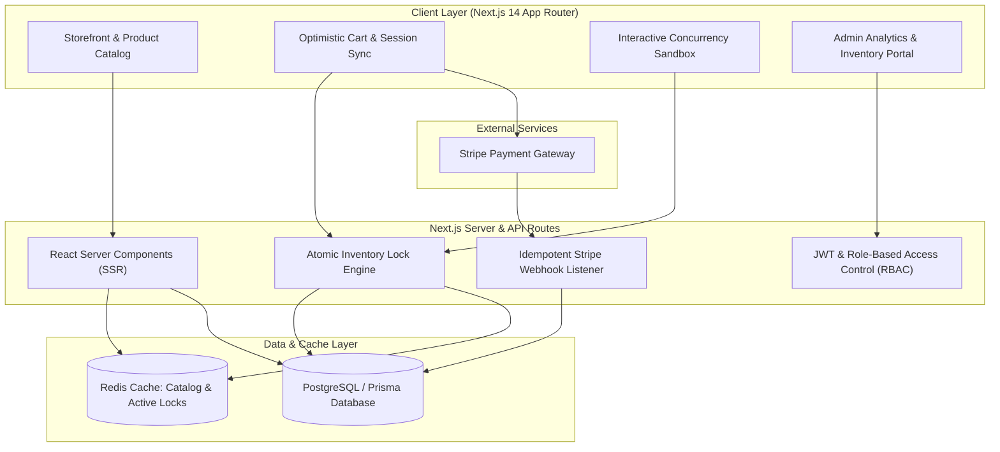

# ⚡ PulseCommerce: Production-Grade E-Commerce & Flash-Sale Platform

[](https://nextjs.org/)
[](https://www.typescriptlang.org/)
[](https://www.prisma.io/)
[](https://redis.io/)
[](https://stripe.com/)
[](https://www.docker.com/)

**PulseCommerce** is a full-stack, enterprise-grade e-commerce platform engineered specifically to solve high-throughput flash-sale bottlenecks, race conditions, low-latency caching, and financial payment idempotency.

---

## 🏛️ System Architecture



---

## ✨ Core Engineering Highlights

### 1. 🛡️ Concurrency & Flash-Sale Race Condition Protection
* **Problem:** In standard e-commerce stores, simultaneous purchase attempts during limited drops lead to inventory overselling.
* **Implementation:** PulseCommerce uses **database transactions (`prisma.$transaction`)** and **atomic inventory reservation holds (`InventoryLock`)** with automated 10-minute TTLs.
* **Interactive Sandbox:** Includes an in-browser concurrency simulation tool (`/api/simulate/concurrency`) allowing you to fire 20-50 simultaneous requests against 5 units and verify zero overselling in real-time.

### 2. 💳 Idempotent Stripe Payment Lifecycle
* **Cryptographic Signature Verification:** Webhooks are verified using HMAC signatures (`stripe-signature`).
* **Deduplication:** Webhook event IDs are stored in the database (`WebhookEvent`), preventing duplicate order fulfillments on network retries.
* **Mock / Offline Fallback Mode:** Seamless local testing mode that works out-of-the-box even without live Stripe credentials.

### 3. ⚡ Multi-Tier Low-Latency Redis Caching
* **Sub-15ms Read Performance:** Caches product catalogs, faceted search results, and category indexes in Redis.
* **Write-Through Cache Invalidation:** Admin inventory modifications instantly purge relevant cache keys (`cache.del` and `cache.invalidatePattern`).
* **Resilient In-Memory Fallback:** Automatically switches to an in-memory TTL store if Redis is unavailable locally.

### 4. 👑 Role-Based Access Control (RBAC) & Admin Portal
* **Customer Portal:** Faceted search, real-time stock meters, optimistic cart drawer, printable order receipts.
* **Admin Control Center:** Live settled revenue metrics, order pipeline transitions (`PENDING -> PAID -> SHIPPED -> DELIVERED`), and real-time low-stock inventory restock controls.

---

## 🚀 Quick Start (Local Setup)

### 1. Clone & Install Dependencies
```bash
cd pulse-commerce
npm install
```

### 2. Configure Environment Variables
Copy `.env.example` to `.env`:
```bash
cp .env.example .env
```
*(Default settings use local SQLite and mock fallback modes for immediate zero-config testing).*

### 3. Push Database Schema & Seed Data
```bash
npm run prisma:push
npm run prisma:seed
```

### 4. Start Development Server
```bash
npm run dev
```
Open [http://localhost:3000](http://localhost:3000) in your browser.

---

## 🧪 Automated Concurrency Stress Test

Run the standalone automated race condition stress test:
```bash
npm run test:concurrency
```
*Spawns 25 concurrent checkout requests simultaneously against a 5-unit inventory item and verifies 100% ACID isolation.*

---

## 👤 Pre-Seeded Evaluation Accounts

| Role | Email | Password | Access |
| :--- | :--- | :--- | :--- |
| **Admin** | `admin@pulsecommerce.dev` | `AdminPass123!` | Full Admin Portal, Analytics & Inventory controls |
| **Customer** | `alex@pulsecommerce.dev` | `CustomerPass123!` | Storefront, Checkout & Order History |

*(The login page features 1-click fill buttons for instant evaluation).*

---

## 🐳 Docker Deployment

To spin up the full multi-container stack with Next.js, PostgreSQL 16, and Redis 7:
```bash
docker-compose up --build
```
